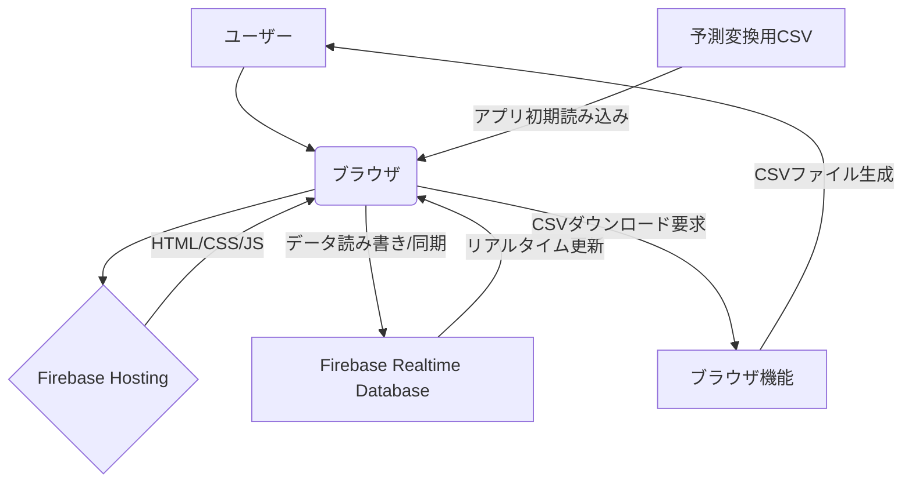

# 12条点検アプリケーション システムパターン

## システムアーキテクチャ
- **クライアントサイドレンダリング (CSR) アーキテクチャ**: 
    - UIの構築とロジックの実行は、すべてユーザーのブラウザ上で行われるシングルページアプリケーション(SPA)として実装する。
    - HTML, CSS, JavaScriptファイルがFirebase Hostingから配信され、ブラウザで実行される。
- **Backend as a Service (BaaS)**: 
    - Firebase Realtime Database をデータストアおよびリアルタイム同期のバックエンドとして利用する。
    - アプリケーションロジックの大部分はフロントエンド (JavaScript) に実装される。

## コンポーネント間の関係

- **ユーザー**: アプリケーションをブラウザ経由で操作する。
- **ブラウザ**: HTML, CSS, JavaScript を実行し、UI を表示。Firebase SDK を介して Realtime Database と通信する。
- **Firebase Hosting**: アプリケーションの静的ファイル (HTML, CSS, JS) を配信する。
- **Firebase Realtime Database**: アプリケーションデータ（基本情報、建物情報、劣化情報）をJSON形式で保存し、接続されているクライアント間でリアルタイムに同期する。
- **ブラウザ機能**: JavaScript を使用して、Realtime Database から取得したデータをCSV形式に変換し、ユーザーにダウンロードさせる。
- **予測変換用CSV**: アプリケーション起動時に読み込まれ、JavaScript内で予測変換リストのデータソースとして使用される。

## 採用している設計パターン
- **タブUIパターン**: 「基本情報」と「劣化情報」のセクションを切り替えるために使用。
- **シングルページアプリケーション (SPA)**: ページ遷移なしに動的にコンテンツを更新。
- **Observerパターン (Firebase Realtime Database)**: データベースの変更をリアルタイムに検知し、UIに反映させる。
- **予測変換 (Autocomplete/Typeahead) パターン**: ユーザーの入力に基づいて候補リストを表示し、入力を補助する。
- **Repositoryパターン (概念的)**: Firebaseとのデータ操作をラップする関数群を作成し、UIロジックとデータアクセスロジックを分離する（例: `saveDeterioration`, `fetchDeteriorations`など）。

## 実装上の重要な経路
1.  **初期化**: アプリ起動時にFirebaseを初期化し、予測変換用CSVデータをロードする。
2.  **基本情報入力**: フォーム入力内容をRealtime Databaseの特定パス (`/projects/{projectId}/info`) に保存する。
3.  **建物追加**: 新しい建物名をRealtime Databaseの建物リスト (`/projects/{projectId}/buildings`) に追加する。
4.  **劣化情報入力**: 
    - 選択された建物に対応するRealtime Databaseパス (`/projects/{projectId}/deteriorations/{buildingId}`) を決定する。
    - その建物の最後の劣化番号+1を新しい番号として取得する。
    - 場所、劣化名、写真番号と共に新しい劣化データを上記パスに追加する。
    - 入力中に予測変換リストを表示する。
5.  **データ表示**: 選択された建物の劣化情報をRealtime Databaseから取得し、テーブルに表示する。リアルタイムリスナーを設定し、変更があれば自動でテーブルを更新する。
6.  **データ編集**: テーブル内の編集ボタンクリックでモーダルを開き、編集内容をRealtime Databaseの該当データに上書き保存する。
7.  **CSVエクスポート**: 選択された建物の劣化情報をRealtime Databaseから取得し、CSV形式に整形してダウンロードさせる。 